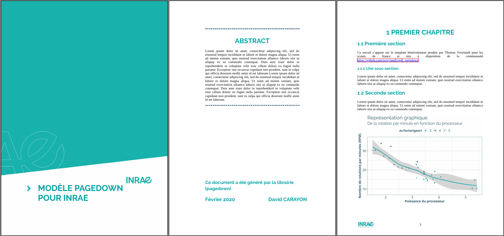

# Template (non-officiel) {pagedown} pour INRAE

Ce modèle s'appuie sur le template bénévolement produit par Thomas Vroylandt pour les scouts de france et mis à disposition de la communauté [https://github.com/tvroylandt/sgdf_pagedown](https://github.com/tvroylandt/sgdf_pagedown).

L'obectif de ce modèle est de produire un document (rapport technique, note, tutoriel, etc.) respectant la charte graphique INRAE tout en minimisant les efforts de mise en forme. Le fichier `INRAE_pagedown.Rmd` est à éditer en syntaxe markdown pour le fond du document, puis la mise en forme est produite par {pagedown}(faisant appel à paged.js) combiné à des élements de css situés dans `style/`.

Ce document est produit au format .html paginé (pour une lecture web) ainsi qu'au format pdf pour impression. Il est donc possible d'inclure des visualisation web-interactives pour la sortie format html.

# Thème INRAE

Dans `R/theme_inrae` se situent 4 fonctions de thème ggplot développées pour correspondre à la charte INRAE. Il serait souhaitable que ces fonctions, une fois améliorées et complétées par d'autres modules, soient intégrées dans un package pouvant être plus largement diffusé.

# Contact

En cas de problèmes ou pour toute question, contacter :

- [david.carayon@inrae.fr](mailto:david.carayon@inrae.fr)

# Référence pour pagedown :

Yihui Xie, Romain Lesur and Brent Thorne (2020). pagedown: Paginate the HTML Output of R
  Markdown with CSS for Print. R package version 0.8.
  https://CRAN.R-project.org/package=pagedown
  
# Pour contribuer (Rappel) :

  -Find a project you want to contribute to
  - Fork it
  - Clone it to your local system
  - Make a new branch
  - Make your changes
  - Push it back to your repo
  - Click the Compare & pull request button
  - Click Create pull request to open a new pull request
